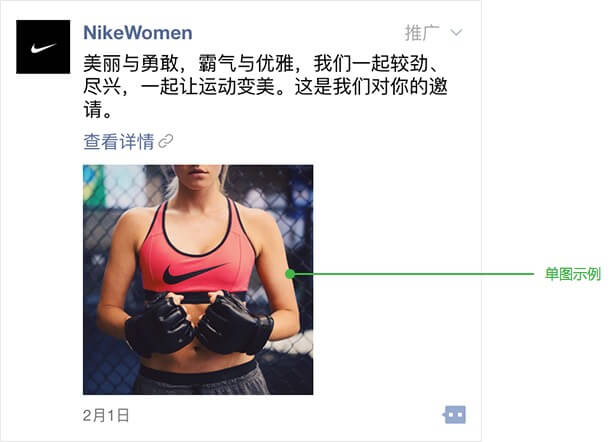
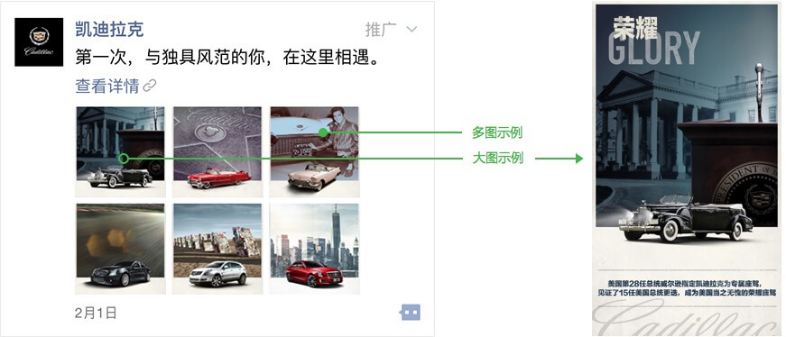
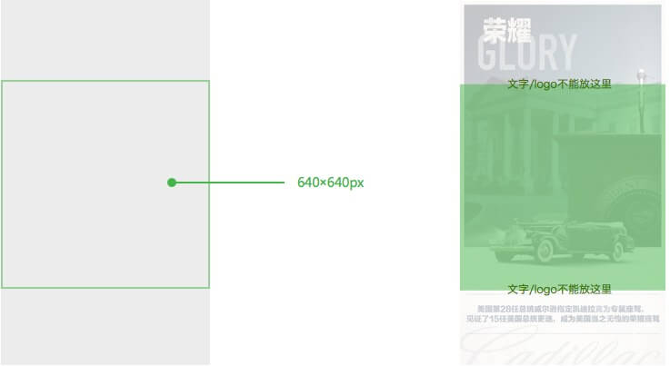

title: "外层方案规范/图片规范"
date: "2015/9/10"
---

### 单图规范

- 单张图片大小要求300KB以下
- 图片内容与文案、详情页关联
- 图片内尽量不使用文字，若使用要保证文字在手机上易读
- 为了使外层图片获得最佳展示效果，建议采用这三个尺寸进行设计：800×640px（5:4）、640×800px（4:5）、800×800px（1:1）

### 多图规范

- 图片建议数量：3/4/6张 （单张大小要求300K以下）
- 图片内容与文案、详情页关联
- 为了使图片获得最佳展示效果，建议选择一个推荐尺寸进行设计：800×800px（1:1）、640×960px（1:1.5）、640×1136px（1:1.775）
- 图片中间正方形区域（下图绿框内区域）是朋友圈自动裁剪图片后显示在列表上的部分，为在了保证在显示效果,规范如下:  
a. 这个区域要有比较完整的图像  
b. 区域内尽量不使用文字，若使用要保证文字在手机上易读  
c. 文字及logo等元素不放在方形区域的边缘以免被裁切  

