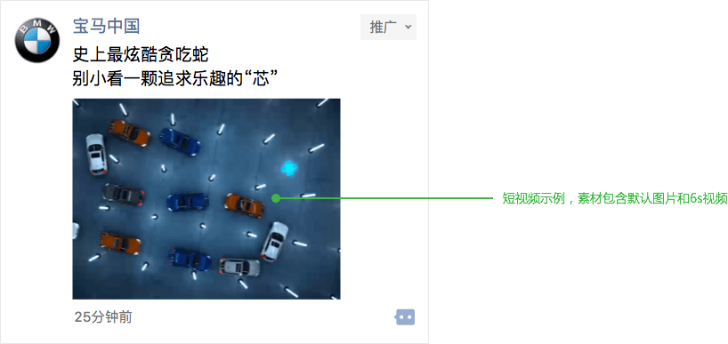
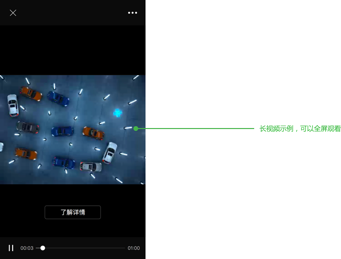

title: "视频广告规范"
date: "2016/1/10"
---

### 外层缩略视频规范

视频参数：
- 时长：6秒
- 格式：MP4
- 视频编码：H.264
- FPS：24
- 码率：小于 800 kbit/s
- 文件大小限制：约 700KB 以内
- 尺寸/分辨率：320×240px
- MP4 Profile：Main
- 音轨格式：AAC
- 音轨 Sample Rate：<44.1 kHz
- 音轨 Datarate：<96 kbit/sec

默认图片（可选）：
- 尺寸：480×360px
- 大小：小于100k

### 内部完整视频规范

视频参数：
- 时长：300 秒以内
- 格式：MP4
- 编码：H.264
- FPS：24
- 码率：小于 800 kbit/s
- 文件大小限制：不得高于 25MB
- 尺寸/分辨率：960×720 / 960×540px
- MP4 Profile：Baseline
- 音轨格式：AAC
- 音轨Sample Rate：<44.1 kHz
- 音轨 Datarate：<96 kbit/sec

 

两版视频内容均需填满画面，不在上下或左右留纯色区域，以下为不合格示例：

