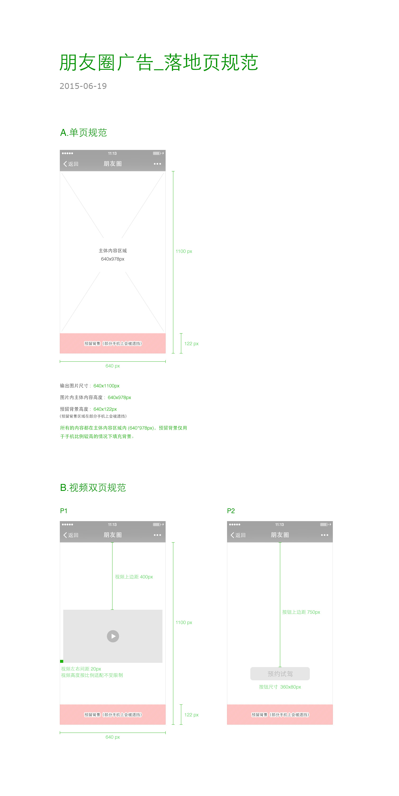

title: "详情页视觉交互规范/模版详情页规范"
date: "2015/9/10"
---

### 模版详情页规范

* 页面数量：1~2页
* 页面内容建议简洁有力，不得有诱导分享、诱导关注等页面提示内容。
* 图片尺寸640像素X1100像素。为了保证各类机型下详情页能正常展现，建议页面上面部分640像素X1100像素作为详情页的“主体内容”，承载主要创意。
* 点此下载[视频双页模版PSD文件](files/template-image-psd.zip)。

