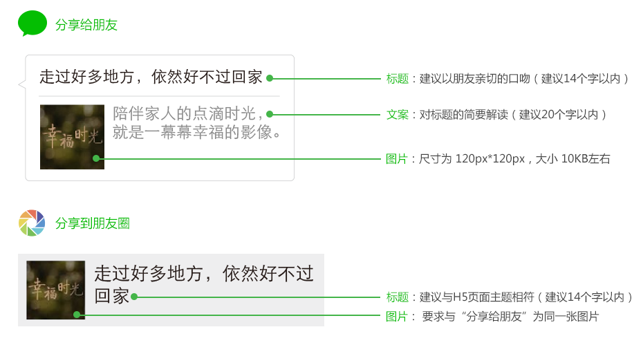

title: "详情页视觉交互规范/分享规范"
date: "2015/9/10"
---

### 分享规范

  

- 文案不支持使用特殊符号，符号使用规范：  
	对于常用标点符号的使用，应符合符号的基本用法，请参考国家[《标点符号用法》](http://www.moe.gov.cn/ewebeditor/uploadfile/2015/01/13/20150113091548267.pdf)
- 不得使用特殊符号，特殊字符与符号表情不可使用，例如：“：）”“-。-”等等，同时不可使用的常用符号还包括：@ # & * + - × ? ~
