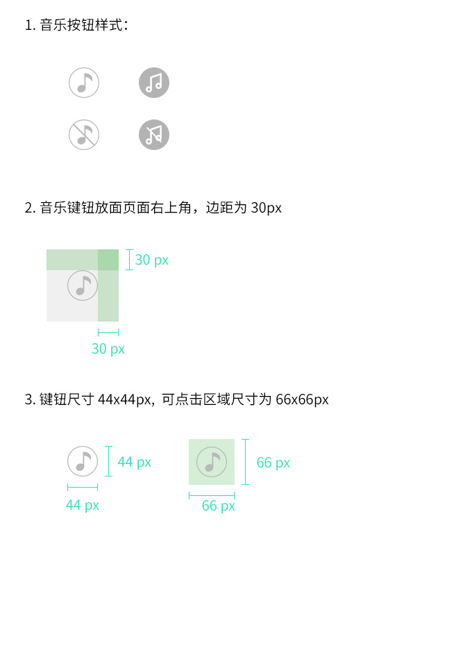

title: "模版详情页规范"
date: "2014-03-16 18:17:16"
---

###图片要求###

 * 页面数量：1~2页
 * 页面内容建议简洁有力，不得有诱导分享、诱导关注等页面提示内容。
 * 图片尺寸640像素X1100像素。为了保证各类机型下详情页能正常展现，建议页面上面部分640像素X1100像素作为详情页的“主体内容”，承载主要创意。
 * 点此下载[视频双页模版PSD文件](files/template-image-psd.zip)。

###图片要求###

 * 详情页如使用背景音乐，则必须支持音乐可循环及可关闭，并采用渐强（音乐逐渐变大）的方式出现；
 * 音乐播放/关闭按钮，必须参照规范，并放置于页面左上角位置，详细参考下图。
 * 点此下载[音乐iconPSD文件](files/template-music-icon-psd.zip)。

