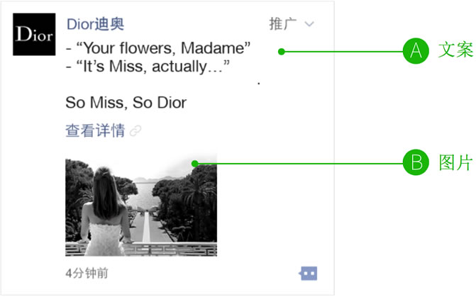
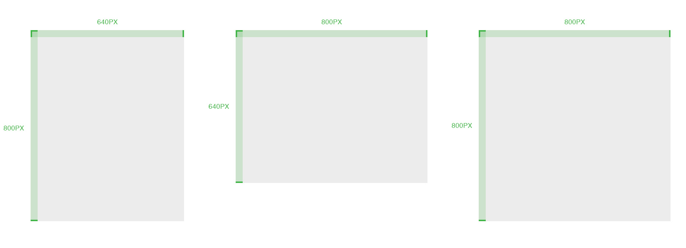
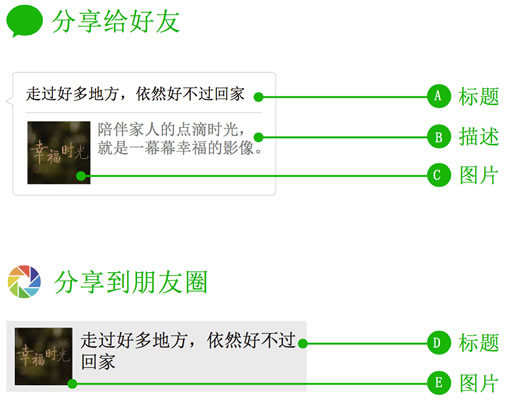

title: "视觉交互规范"
date: "2014-03-16 18:17:16"
---

### 文案要求

- 文案文字不超过40字
- 文案风格建议: 朋友亲切的口吻，简约而不简单
- 文字中不能有URL，不要特殊字符
- 文案与图片关联，与详情页关联

### 图片要求

 - 图片建议数量：1张 (单张大小要求300KB以下)
 - 图片内容与文案、详情页关联
 - 为了使外层图片展示最大化，我们建议采用以下三个尺寸进行设计：800px\*640px（5:4）、640px\*800px（4:5）、800px\*800px（1:1），
为在了保证在朋友圈的显示效果，规范如下：
    - 这个区域要有比较完整的图像
    - 区域内尽量不放文字，放的话不超过两行
    - 文字及logo等元素不放在方形区域的边缘以免被裁切

### 分享规范

- A - 标题建议以朋友亲切的口吻（14个字以内）
- B - 描述建议 20 字以内
- C - 图片尺寸为120px\*120px，大小建议10KB左右
- D - 标题建议 14 个字以内
- E - 图片尺寸为120px\*120px，大小建议10KB左右

### 详情页通用规范

 - 允许用户分享广告详情页，但不得有诱导分享、诱导关注等页面提示内容；
 - 使用用户关系链进行的互动分享，需要注意分享逻辑的完整性；
 - 详情页如使用背景音乐，则必须支持音乐可循环及可关闭（关闭按钮采用模版样式），并采用渐强（音乐逐渐变大）的方式出现；
 - 详情页如使用视频文件，需先上传至腾讯视频。广告详情页仅支持使用腾讯视频的视频内容；如视频总长度超过1分钟，需要再底部加上“建议在WIFI下加载播放”提示；
 - 对页面的加载时间进行监控，加载耗时过长时，给予用户友好的提示；
 - 非 WIFI 环境下时的提示建议：复杂交互页面若流量消耗会很大时，建议对用户进行友好的提示，可能会消耗较多流量；

### 详情页支持形式

- √ 品牌活动
- √ 微信小店
- √ 微信表情
- × APP 下载（后续支持）
- × H5 小游戏（后续支持）

### 详情页实现

 * 详情页交互简洁，重点展示图片创意，可以考虑在【微信公众号-朋友圈推广-详情页管理】根据模板生成详情页。参考[模板详情页规范](https://wximg.qq.com/tmt/wxmoment/template.html)
 * 交互形式个性化，互动元素丰富，需自行开发自定义详情页。为了提高开发效率，建议按照微信广告“[自定义详情页前端工作流](https://wximg.qq.com/tmt/wxmoment/workflow.html)”，使用“[自定义详情页前端通用库](https://wximg.qq.com/tmt/wxmoment/WxMoment.html)”，保证[详情页符合技术规范](https://wximg.qq.com/tmt/wxmoment/dev.html)
